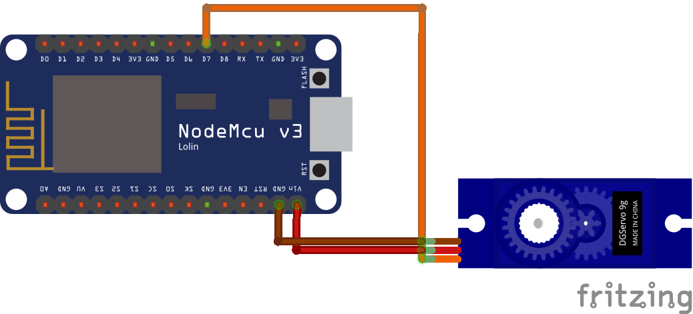
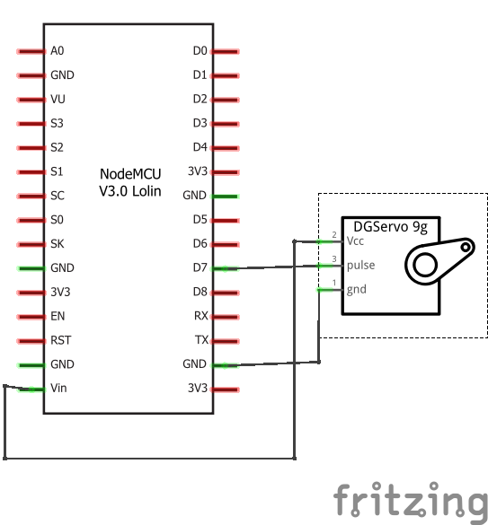
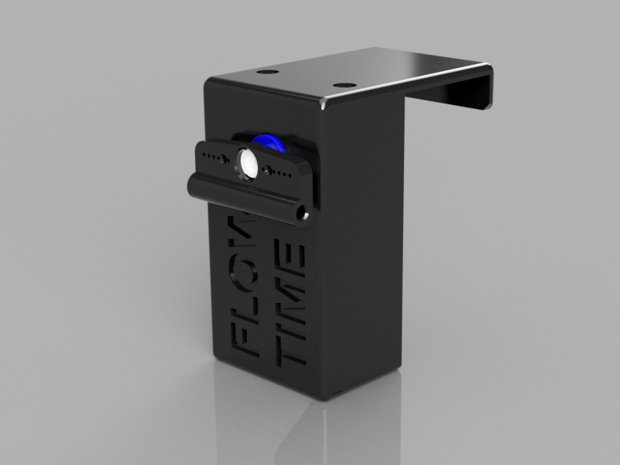
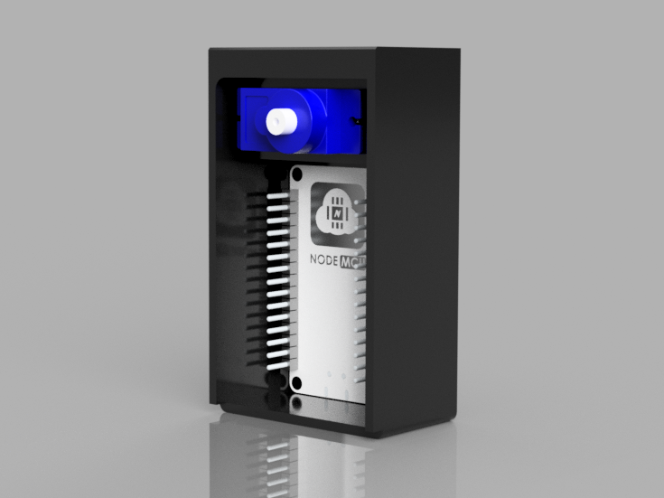

# Flow Time Flag

An IoT device powered by an ESP8266 microcontroller that signals [flow time](https://en.wikipedia.org/wiki/Flow_(psychology)) with a flag.

## How it works

This code connects to the specified time server to retrieve the current time adjusted to your current time zone and daylight saving preferences. Based on the specified time range for flow time it rotates a servo motor.

## Getting started

### Hardware

For the electronics all you need is a NodeMCU ESP8266 microcontroller and an SG90 servo motor. The servo needs +5V, so you have to power your board from USB, and then connect the servo to the `Vin` and `GND` pins of the NodeMCU. To control the servo position the code uses the `D7` pin (you can change that in `config.h`).

If you wish to further improve this wiring you can download the [Fritzing Sketch](./doc/wiring/flowtime-flag.fzz) as well.

### Enclosure

You can find the enclosure designed for 3D printing for this project here: https://www.thingiverse.com/thing:4012382

### Software

Load the project into the Arduino IDE (or Visual Studio Code) and import the [WiFiManager library](https://github.com/tzapu/WiFiManager).

Update the parameters in the `config.h` file and upload the sketch to your ESP8266.

### Usage

If you have not connected your ESP8266 to the network before, when first boot up it will create a new WiFi network with the parameters specified in `config.h`. By default the network name is `FlowTimeFlag`.

Connect to this WiFi network with the password specified in `config.h` (by default `FlowTime!`).

Open your favorite web browser and navigate to `http://192.168.4.1`, and configure the WiFi connection. Upon save your device will restart and automatically connect to the specified WiFi network.

## Acknowledgements

Thanks to [Andreas Spiess](https://github.com/SensorsIot) for sharing his [NTP library for ESP8266](https://github.com/SensorsIot/NTPtimeESP), though I had to change his code to make it more reliable.

Thanks to [Roman Minyaylov](https://github.com/roman-minyaylov) for sharing his [NodeMCU Fritzing part](https://github.com/roman-minyaylov/fritzing-parts). I copied the current version of that part into the `./doc/wiring/esp8266-nodemcu-v3` folder.

## About the author

This project is maintained by [György Balássy](https://linkedin.com/in/balassy).
